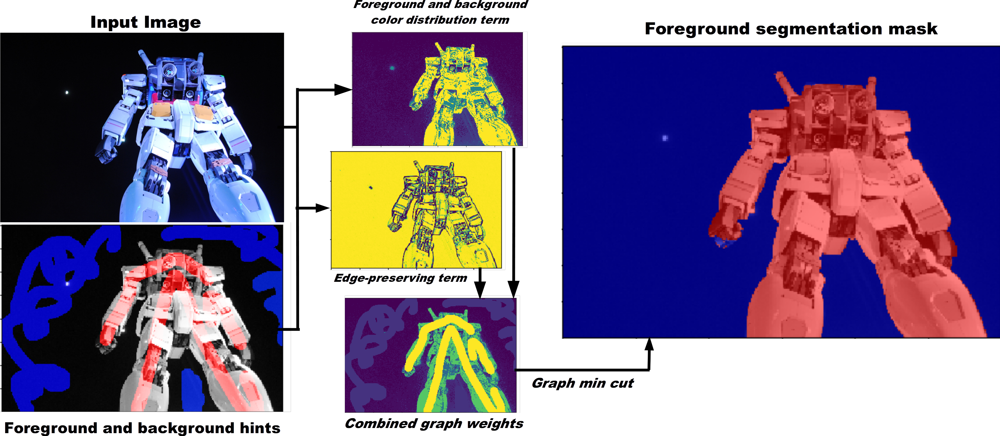

# Python GraphCut Implementation



## Writeup

[Writeup is at writeup/writeup.pdf](writeup/writeup.pdf)

## Prereqs

```
pip install numpy scipy networkx yaml
```

Tested on Python 2.7. Probably works on anything.

## How to use

Brief parameter definitions:
- color_image: Path from the CWD to the color image being used.
- label_image: (GraphCut only) Path from CWD to a label image. Prefer BMP or lossless compression. Match resolution to the color image precisely. Red values == 255 are foreground labels, blue values == 255 are background labels.
- image_scale: Fraction by which the color + label image will be scaled down (so 4 = scaled down to 25%) before processing.
- n_hist_bins: Number of histogram bins for fitting FG/BG distribution over pixel color or intensity. 50 has always worked great.
- dist_lambda: K_lambda in the writeup. Higher weights the color distribution term more strongly, and hence the edge preservation less strongly.
- neighbor_inds: List of offsets used in computing edge terms. [-1, 0, 1] computes an 8-neighborhood. Pushing it higher had little benefit but was way slower.
- diff_in_color_space: True/False -- whether or not to take edges in color or luminance space.
- B_sigma_scaling: K_\sigma in the paper. 1 works great. Roughly speaking, changes the specifitiy of the edge-preserving term -- higher makes the filter consider a wider variety of contrasts to be "not an edge" and hence to be places where cuts should not be placed.

For more details please see the writeup.

To run `GraphCut`:
- Edit the `main()` function in `graphcut.py` (around line 300) to select which `params` are active, according to above.
- Run `python graphcut.py`.

To run `GrabCut`:
- Edit the `main()` function in `grabcut.py` (around line 130) to select which `params` are active, according to above.
- Run `python grabcut.py`. Click and drag to select a box (smaller runs faster, but still try to provide a reasonable amount of background around the object to be segmented). Once you release, segmentation will be calculated and displayed. If you close all the generated figures, you can select again, but it's easier just to restart the whole script.

Other files that you probably shouldn't run:
- `build_train_and_test_lists.py` rebuilds a list of benchmark example image/label pairs.
- `run_grabcut_on_data.py` runs Grab/GraphCut against that benchmark dataset over a broad range of parameters, appending to `results.yaml` the results of those runs, and saving intermediate images to `/tmp/Output`.
- `analyze_data.py` makes plots for the writeup. It's disgusting.
- `plot_random_segmentations.py` makes a plot for the writeup but loading dataset images + results from the above scripts. It's even more disgusting.